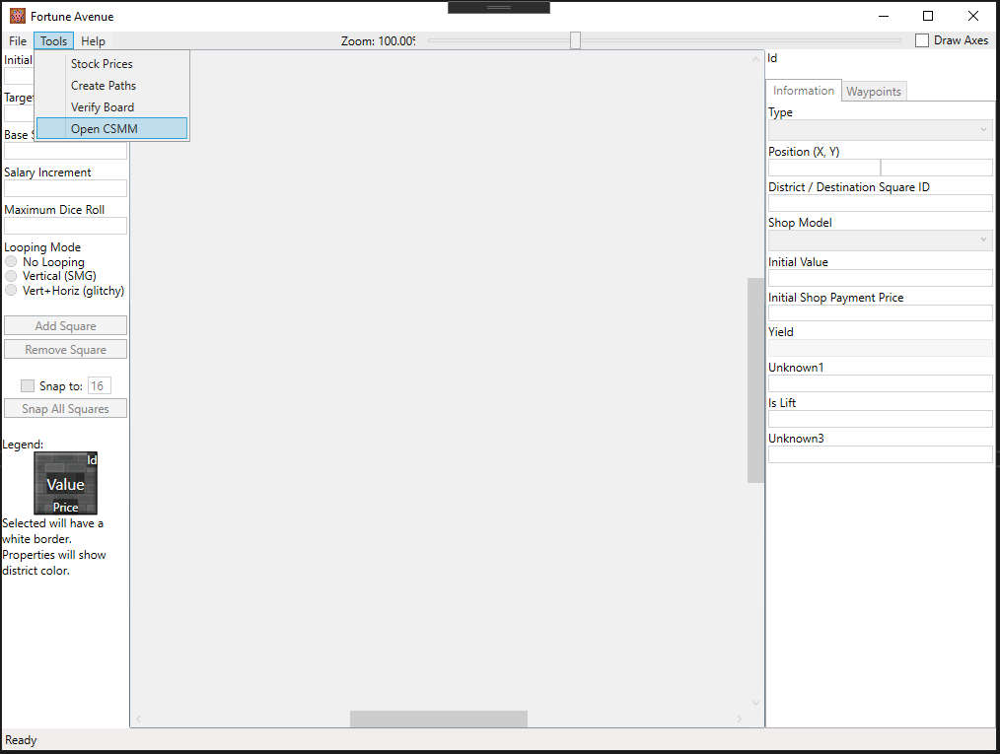
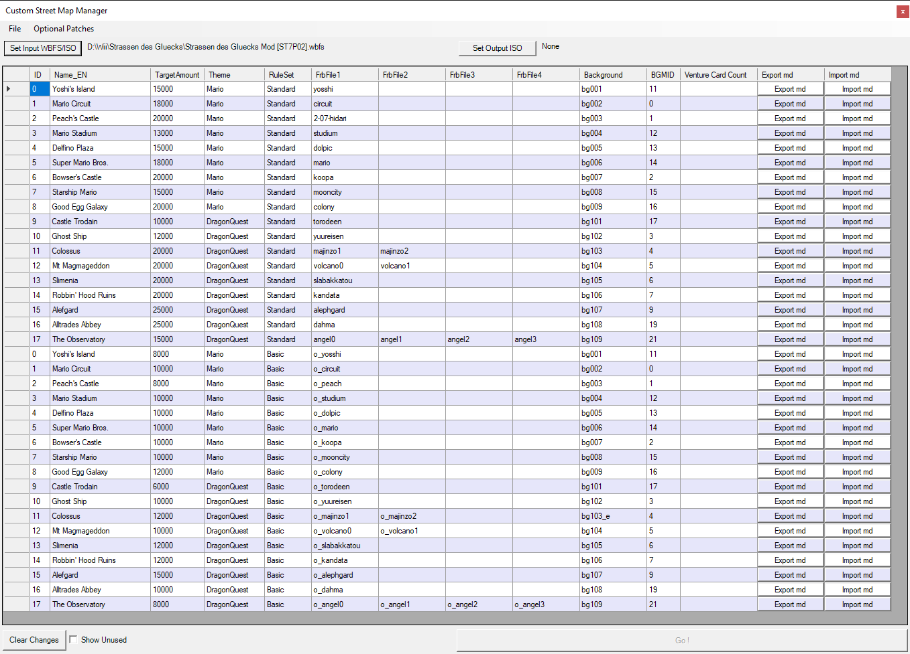

# How to use CSMM

First of all, you need to open the Custom Street Map Manager under Tools -> Open CSMM.

## CSMM Main UI

When CSMM starts up, it is best to first open your Boom Street wbfs or iso file by clicking on "Set Input WBFS/ISO".

In the center you see the table of all standard maps of Boom Street. The first 18 maps are for the standard rules the latter 18 for the basic rules. The unused maps are not shown here unless you click on the checkbox "Show Unused" at the bottom of the ui.

Editting the values in the UI is not possible. If you want to modify a map you need to export the corresponding md file first (md = map descriptor). Then you edit the exported md file and import it back using Import md. 

## Map Descriptor

The map descriptor md file defines the data that is to be written into the WBFS/ISO file. It is also a markdown file at the same time and as such can easily be viewed within github. Check the map templates to see how such a markdown file is structured:
- [Template Map Good Egg Galaxy](https://github.com/FortuneStreetModding/CommunityMaps/tree/master/TemplateMap_Colony)
- [Template Map Colossus](https://github.com/FortuneStreetModding/CommunityMaps/tree/master/TemplateMap_Colossus)

The structure is as follows:
- The first heading is always the English name of the map. The section contents is the English description of the map.
- For the next headings the parser checks for certain keywords:
- If the heading contains the keywords Properties, Configuration or Localization then the table contained in that section is parsed as a key value map
- If the heading contains the keywords Background, Background Music or Venture Card then the table contained in that section is parsed as true/false list with the the string :o: denoting a true entry.

## Cache

When opening an input WBFS/ISO file, CSMM will extract its contents and you can see a new folder residing in the same directory as Fortune Avenue. The name of the folder will be the same as the WBFS/ISO you selected. This cache will be kept and reused by CSMM for the case that the same WBFS/ISO will be patched again. 