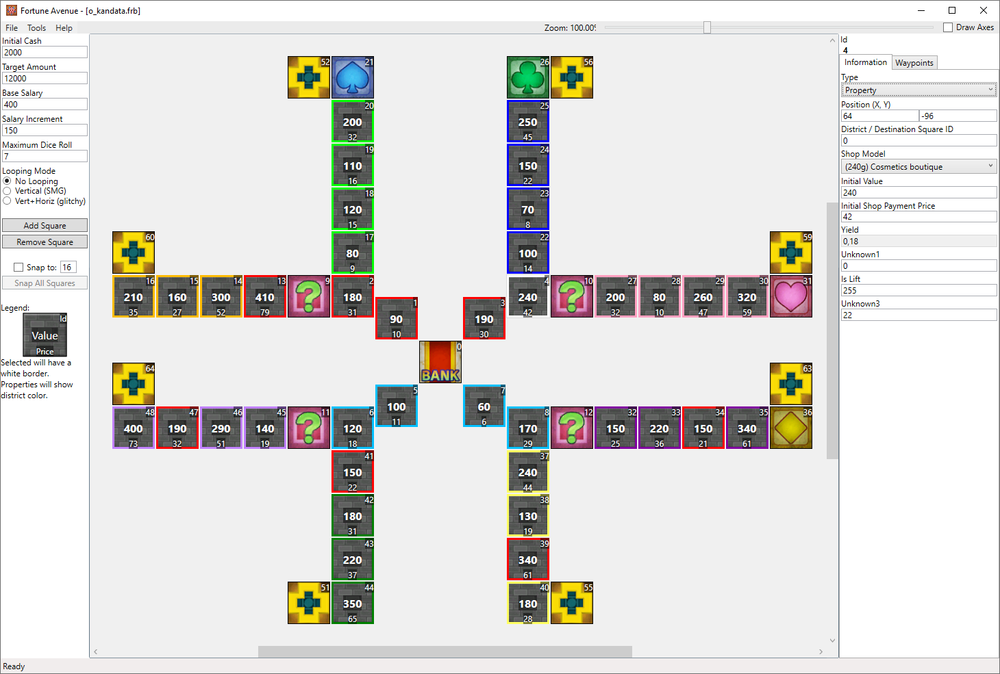

# Deprecated

This tool is deprecated and has been supersceeded by FortuneAvenue-qt and CSMM-qt:
- https://github.com/FortuneStreetModding/fortune-avenue-qt
- https://github.com/FortuneStreetModding/csmm-qt

As such, this repository has been archived.

FortuneAvenue
=============

Fortune Street editor.  Continuation of the editor released at <http://www.gamefaqs.com/boards/632973-fortune-street/61369903?page=7>.

<dl>
  
</dl>

## Changelog

The format is based on [Keep a Changelog](https://keepachangelog.com/en/1.0.0/)

### [Unreleased]
**Added**
- New Square Type: Event Square
  - Set the districtId property of that square type to any number between 1 and 128. Any player landing on that square will trigger that specific venture card.
- More board verification checks
- Shortcuts for Saving/Loading boards
- CSMM is now integrated into Fortune Avenue. You can open it under Tools.
- CSMM has more features
  - Possibility to change per map:
    - Available Venture Cards
    - Switch Maps and Switch Animation Rotation Origin Points
    - Map Icons
    - Map Names and Description (with multi language support for Boom Street)
    - Tour Configuration (Tour Opponents, etc.)
    - Background
    - Background Music
    - Target Amount
    - Theme (Mario or Dragon Quest)
    - Rules (Easy or Standard) 
    - Galaxy Looping Mode Configuration (Radius, etc.)
  - Possibility to add new maps
  - Possibility to set the tutorial maps
  - Implements various ASM Hacks
    - Proper display of new map icons
    - Use of the boards game rule setting (easy/standard) instead of the menu game rule setting. This gives the possibilty to have standard rule maps in the easy mapSet and vice versa. 
    - Injects asm hack for the Event Square to work
    - Injects new map icon for the tutorial map background

### [v8] - 2020-06-05
**Added**
- More textures for square tiles
- Possibility to edit unknown values of square tiles 
- Possibility to edit the lift type value for square tiles

**Changed**
- Prevent door tiles from being autopathed

### v7 - 2019-10-06
**Changed**
- Fix bug which causes new squares not to calculate value and price automatically

### v6 - 2019-07-18
**Added**
- The SquareType 0x2E can now be selected in the Map Editor. This is needed for the ASM hacked main.dol
- The yield of each shop is now automatically calculated and displayed. The formula of yield is:
yield = -0.15 * 0.2 ^ (0.005*value) + 0.2
- When choosing a shop model the default values are now loaded.
- Add additional sanity checks to prevent crashes.

[Unreleased]: https://github.com/FortuneStreetModding/FortuneAvenue/compare/v8...HEAD
[v8]: https://github.com/FortuneStreetModding/FortuneAvenue/compare/v7...v8
